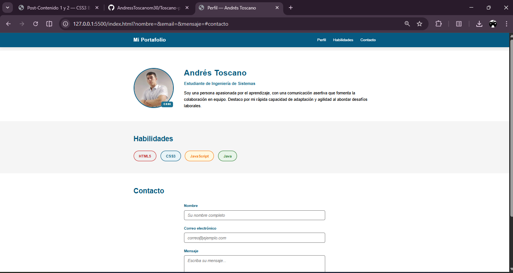

 # Toscano-post1-u3

 Pequeña práctica: página estática con HTML y CSS. Este repositorio debe estar publicado en GitHub con al menos 3 commits descriptivos.

 ## Descripción

 Proyecto de la unidad 3: post/landing simple. La página se visualiza correctamente en Google Chrome en anchos de `1280px` y `375px`.

## Instrucciones de ejecución

Opciones para ver la página:

- Abrir localmente: doble clic sobre `index.html` o arrastrarlo a Google Chrome.
- Servir con Live Server (recomendado):

  - Instala la extensión **Live Server** en VS Code si no la tienes.
  - Abre la carpeta del proyecto en VS Code y abre `index.html`.
  - Haz clic en `Go Live` (esquina inferior derecha) o clic derecho sobre `index.html` -> `Open with Live Server`.
  - Live Server abrirá una URL local (por ejemplo `http://127.0.0.1:5500`), ábrela en Chrome.

 ## Captura de pantalla

 

 ## Verificación en Chrome

 Para comprobar la visualización en los anchos solicitados:

 - Abrir Chrome y pulsar `Ctrl+Shift+I` (DevTools).
 - Activar el dispositivo (Toggle device toolbar) con `Ctrl+Shift+M`.
 - Establecer el ancho a `1280 x <alto>` y comprobar diseño.
 - Cambiar a `375 x <alto>` y comprobar diseño móvil.

 La comprobación manual con DevTools asegura que la página se visualiza correctamente en ambos anchos.
